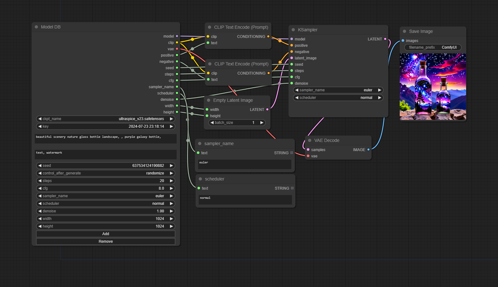

# comfyui-model-db

Store settings by model.

## Usage

Add node > utils > Model DB

Save settings with current checkpoint and current time key as ID.

You can't change key name for simplify process flow.

## Output types

| Field        | Type  | Info                                      |
|--------------|-------|-------------------------------------------|
| model        | MODEL |                                           |
| clip         | CLIP  |                                           |
| vae          | VAE   |                                           |
| positive     | TEXT  |                                           |
| negative     | TEXT  |                                           |
| seed         | INT   |                                           |
| cfg          | FLOAT |                                           |
| smapler_name | TEXT  | Can not link KSampler sampler_name input. |
| scheduler    | TEXT  | Can not link KSampler scheduler input.    |
| denoise      | FLOAT |                                           |
| width        | INT   |                                           |
| height       | INT   |                                           |
| latent       | LATENT|                                           |

## Updates

- Add output latent